# bootswiftui
SwiftUI: Components Library Inspired by Twitter's Bootstrap

# Warning
This is just SwiftUI exercise. Please do not consider using this repo in production.

# Components Roadmap

Component | Support
--- | --- |
Accordion | ✅  
Alert | ✅
Badge | ❌
Breadcrumb | ❌
Buttons | ❌
Card | ❌
Carousel | ✅
Collapse | ❌
Dropdowns | ❌
List Group | ❌
Modal | ❌
Navs & Tabs | ❌
Navbar | ❌
Offcanvas | ❌
Pagination | ❌
Popovers | ❌
Progress | ❌
Spinners | ❌
Toasts | ❌

Component | #1 | #2 | #3 | #4
--- | --- | --- | --- | --- |
Accordion |  | 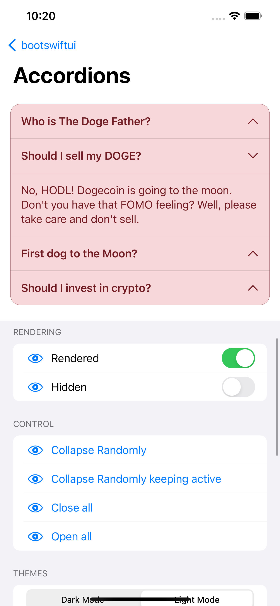 | 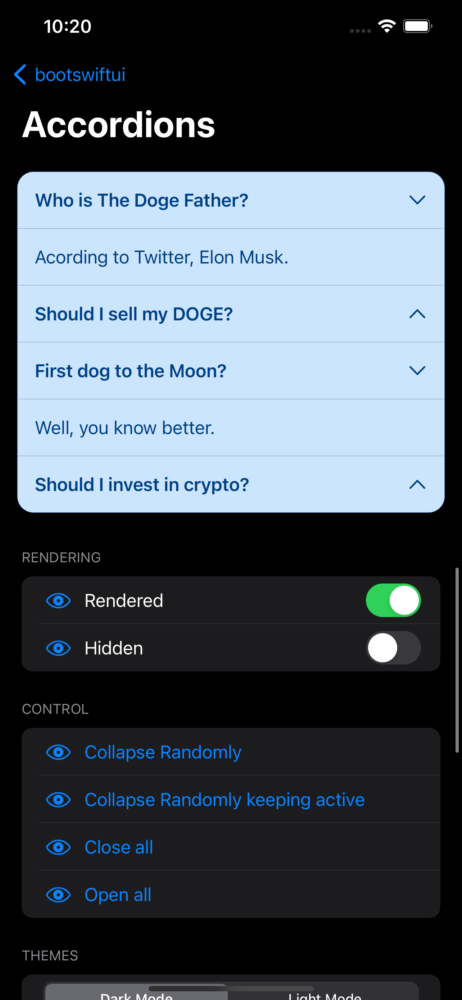 | 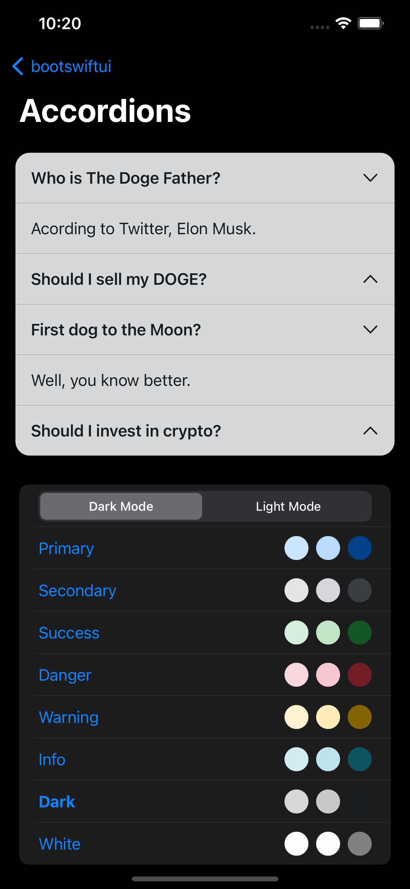
Alert | 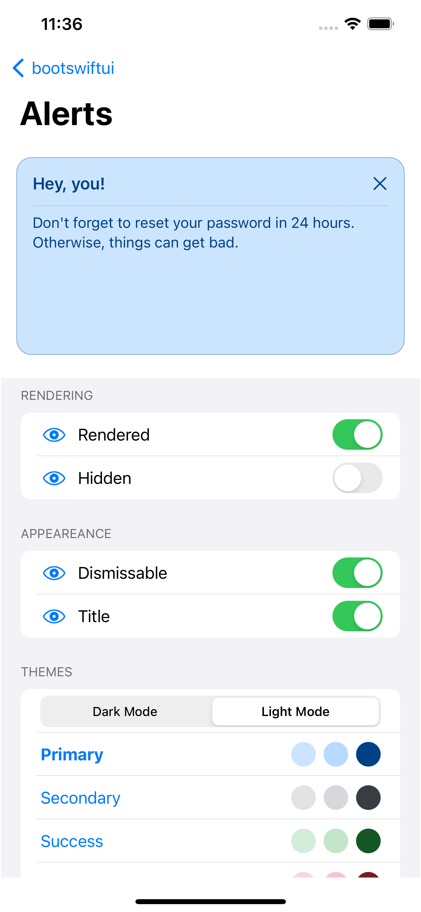 | 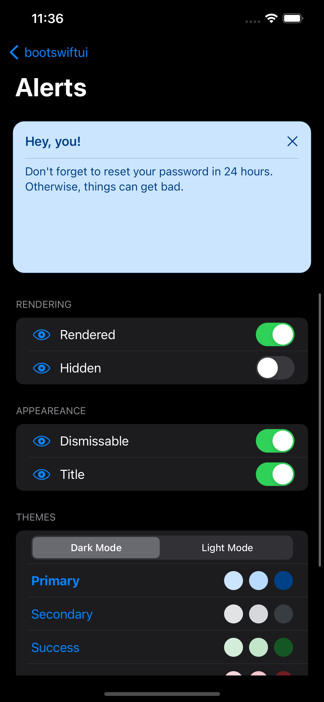 | 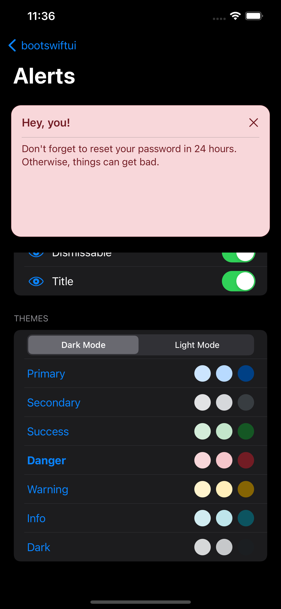 | 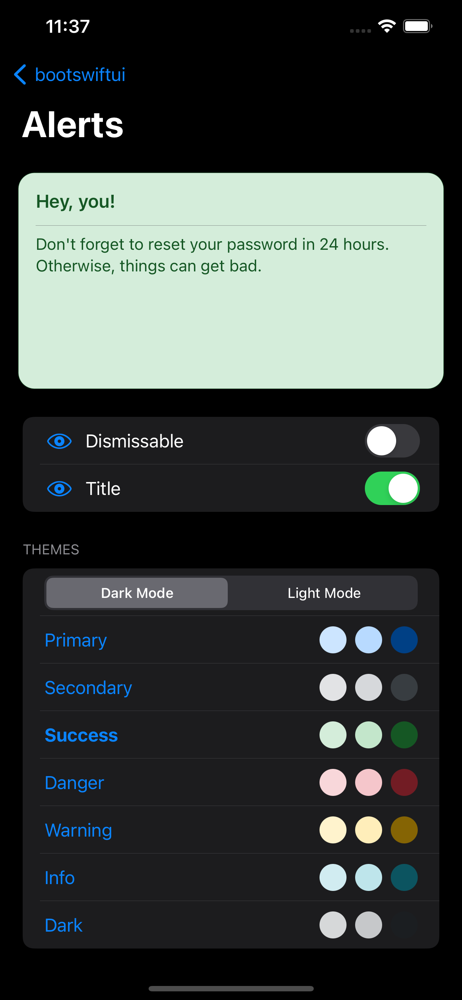 | ![Alt text]
Carousel | 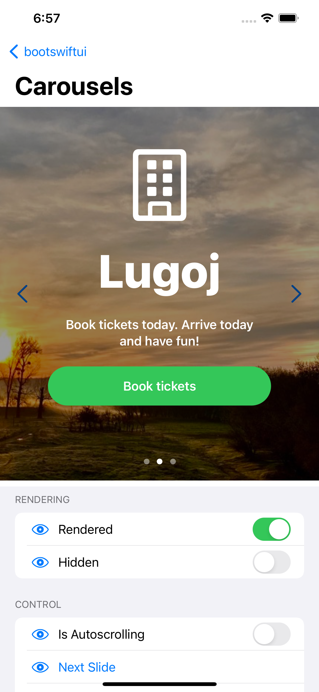 | 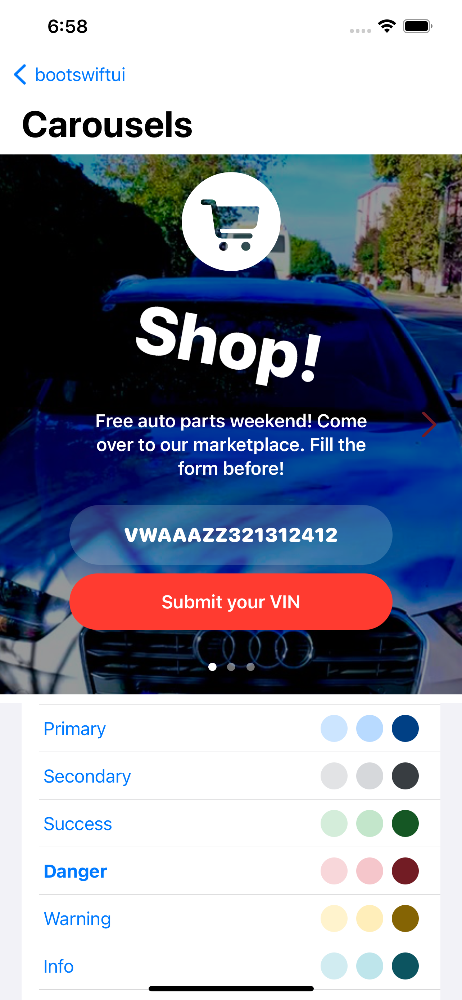 | 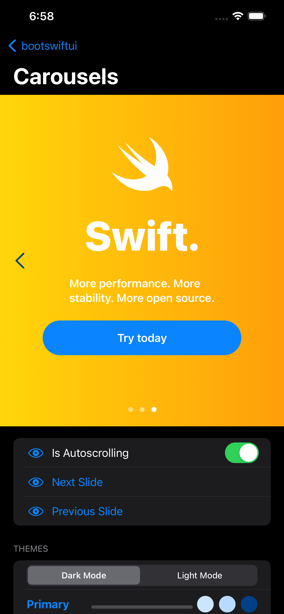 | 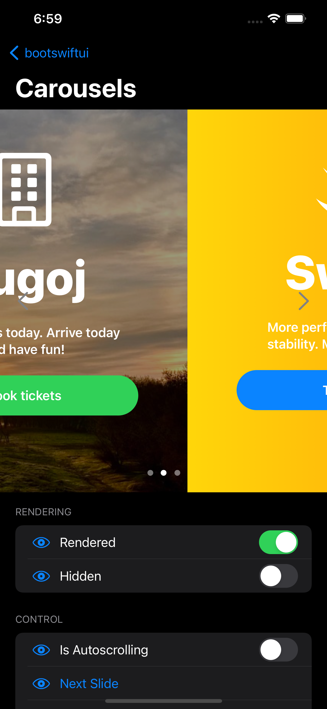
